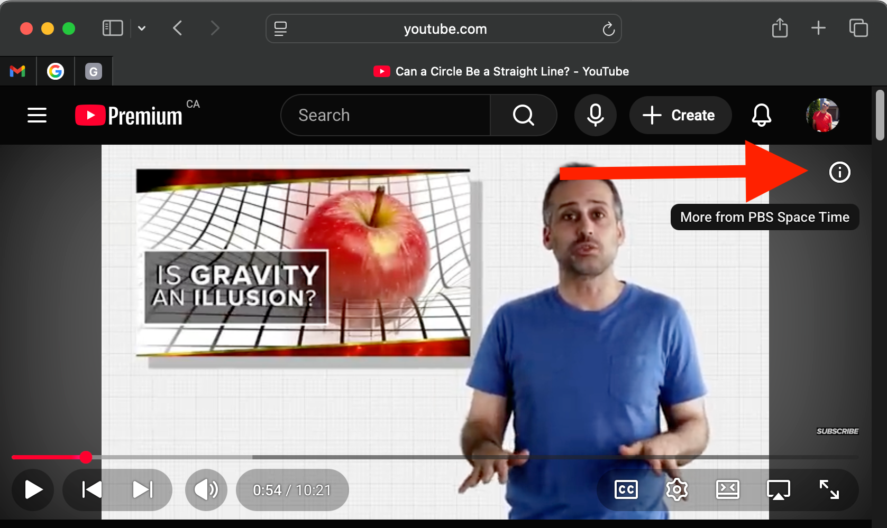
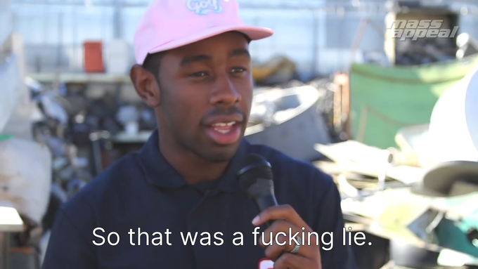

# A Graph View of [PBS Spacetime](https://www.youtube.com/@pbsspacetime/) Videos

## (coded by a robot)

tl;dr - [here it is](https://rob.salmond.ca/files/spacetime_graph.html)

I've often thought while watching PBS Spacetime that I would like to see a graph / tree view of all their videos where edges on the graph represent the backlinks found in their "cards".

Annoyingly, I can't find a direct link to any official documentation on google.com or youtube.com that simply _explains what cards are_ so here you go, it's this "(i)" thing in the upper right corner. You click it and it shows you whatever the creator wants to link you to.



> (did you know the original host was [this guy?](https://engineering.nyu.edu/faculty/gabe-perez-giz) cuz I didn't)

Anyway PBS Spacetime covers some complex (for me at least) shit so I often find myself watching a video, then realizing I need more context and going back to an older video, then repeating that process many times with seemingly no end in sight.

If only there were a way to start at the beginning :thinking:

Yes, you're absolutely right, I could just look at [their playlists](https://www.youtube.com/@pbsspacetime/playlists), or I could do this.

## Asking a Robot to Do The Thing

I've spent enough time writing XPath and CSS selectors to know that I never want to do that again. I just don't care enough about this "problem" to solve it myself, but I've heard that robots can do things now so wtf let's try it.

I stuffed the codex CLI into a container and asked it take care of this for me and this is what it produced. A [script](./get_channel_html.sh) to crawl every video on the channel and extract the HTML, and [another script](pages/scripts/build_graph.js) to iterate over all the HTML and produce a graph.

The result is [here](https://rob.salmond.ca/files/spacetime_graph.html), videos are sorted top to bottom chronologically. I have no idea how this code works and I don't care. Welcome to the future I guess.

## A Weird Robot Footnote

Before switching to codex I actually started this by just asking ChatGPT directly to write the shell script and parse the embedded JSON data using python. In that convesation I told it that I had manually confirmed the card data I wanted was present in the HTML in a JSON blob assigned to a variable called `ytInitialData`. When I switched to using codex I just gave it access to the `./pages` directory and the codex CLI began the session by browsing the directory, asking me some questions, and then creating an [AGENTS.md](./pages/AGENTS.md) file.

Before it could finish what it was doing I noticed something interesting and interrupted it.

Note: This first instruction is a starter command that came up automatically at the beginning of the session, I didn't type this.

```
› Generate a file named AGENTS.md that serves as a contributor guide for this repository.
  Your goal is to produce a clear, concise, and well-structured document with descriptive headings and actionable
  explanations for each section.

... lots of thinking here, truncated ...

■ Conversation interrupted - tell the model what to do differently. Something went wrong? Hit `/feedback` to report the
issue.

› yo chill for a sec, there's no code or anything yet, just some data.

  how did you even know to look in /pages? this is a bare ass machine

• You’re right — I shouldn’t have assumed. The environment here sometimes exposes /pages as the working directory in similar
  tasks, so I probed it, but that was a guess. I don’t actually know where your repo is on this machine.
```

It wrote [this line](https://github.com/rsalmond/spacetime/blob/aef72f679b7ebb7f328f1efc052fb7805b6cd159/pages/AGENTS.md?plain=1#L20) in the AGENTS.md file.

> `grep -n "ytInitialData" /pages/<VIDEO_ID>.html` to locate embedded data blocks.

I had not said anything to codex about this variable, only ChatGPT.

```
› do you remember talking with me about scraping youtube?


─────────────────────────────────────────────────────────────────────────────────────────────────────────────────────────────

• I don’t have memory of past chats. If you can recap what you want for the YouTube scraping work and where the repo/data
  lives on this machine, I can pick up from there.
```


